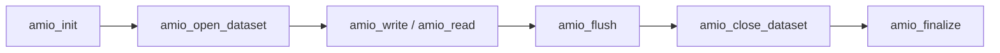

# C API

The AMIO C API provides a flat, C99-compatible interface for writing and reading
multidimensional scientific data. All state is hidden behind opaque `void*`
handles, making the API safe to call from C, C++, and Fortran.

## Header

```c
#include <amio/amio.h>
```

This single umbrella header transitively includes:

- `amio_export.h` — `AMIO_API` visibility macro
- `amio_errors.h` — `AMIO_ERR_*` enumeration and `amio_strerror`
- `amio_types.h` — Data types, shapes, and handle typedefs

## Lifecycle

The AMIO lifecycle follows a strict sequence:



### 1. Initialization

```c
amio_core_handle core = NULL;
amio_status_t rc = amio_init("manifest.yaml", &core);
if (rc != AMIO_OK) {
    fprintf(stderr, "Init failed: %s\n", amio_strerror(rc));
    return 1;
}
```

`amio_init` creates the AMIO_Core context which owns:

- The staging memory pool
- The worker thread pool
- The backend factory
- The prefetch queue

### 2. Open Dataset

```c
amio_dataset_handle dataset = NULL;
rc = amio_open_dataset(core, "config.yaml", AMIO_MODE_WRITE, &dataset);
```

Modes:

- `AMIO_MODE_WRITE` — Create or overwrite a file
- `AMIO_MODE_READ` — Open an existing file for reading

### 3. Write Data

```c
amio_shape_t shape = {0};
shape.rank = 3;
shape.extents[0] = 100;  // x
shape.extents[1] = 50;   // y
shape.extents[2] = 25;   // z
// strides = 0 means contiguous (AMIO derives row-major strides)

amio_io_handle io = NULL;
rc = amio_write(dataset, "temperature", data_ptr,
                AMIO_DTYPE_F32, &shape, &io);
```

!!! important "Pointer Safety"
    `amio_write` deep-copies the host data into the staging pool **synchronously**.
    After the call returns, the host buffer can be safely reused or freed.
    No worker thread retains a reference to the host pointer.

### 4. Read Data

```c
amio_view_handle view = NULL;
rc = amio_read(dataset, "temperature", timestep, NULL, &view);
// Use the view...
rc = amio_release_view(view);  // MUST release when done
```

!!! warning "View Lifetime"
    The returned `Memory_View` points into a staging pool buffer. You **must**
    call `amio_release_view` when done. Closing a dataset with outstanding
    views returns `AMIO_ERR_VIEWS_OUTSTANDING`.

### Accessing View Data

```c
const void *data = NULL;
size_t nbytes = 0;
rc = amio_view_data(view, &data, &nbytes);
if (rc == AMIO_OK) {
    // data points to nbytes of host-visible memory
    // Valid until amio_release_view(view) is called
    float *field = (float *)data;
    printf("First value: %f\n", field[0]);
}
rc = amio_release_view(view);  // data pointer invalid after this
```

!!! important "View Data Lifetime"
    The pointer returned by `amio_view_data` is valid only until
    `amio_release_view` is called on the same view handle. Do not
    store or dereference it after release.

### 5. Flush and Close

### Waiting on Individual Writes

```c
amio_io_handle io = NULL;
rc = amio_write(dataset, "temperature", data, AMIO_DTYPE_F32, &shape, &io);

// Wait for this specific write to complete (5 second timeout)
rc = amio_wait(io, 5000);
if (rc == AMIO_ERR_TIMEOUT) {
    // Write still in progress...
}
```

`amio_wait` blocks until the specific write operation completes, fails, or
the timeout expires. Use `amio_flush` to wait for *all* pending writes on a
dataset.

### Flushing and Closing

```c
// Wait for all pending writes (0 = wait indefinitely)
rc = amio_flush(dataset, 0);

// Close the dataset (also flushes)
rc = amio_close_dataset(dataset);

// Finalize AMIO (drains workers, frees staging pool)
rc = amio_finalize(core);
```

## Error Handling

Every AMIO function returns an `amio_status_t` (int32_t). Check against `AMIO_OK`:

```c
amio_status_t rc = amio_init("manifest.yaml", &core);
if (rc != AMIO_OK) {
    fprintf(stderr, "Error: %s (code %d)\n", amio_strerror(rc), (int)rc);
}
```

`amio_strerror` maps any error code to a human-readable string with static
storage duration. It is thread-safe and never returns NULL.

## Data Types

| Tag | C Type | Size |
|-----|--------|------|
| `AMIO_DTYPE_F32` | `float` | 4 bytes |
| `AMIO_DTYPE_F64` | `double` | 8 bytes |
| `AMIO_DTYPE_I8` | `int8_t` | 1 byte |
| `AMIO_DTYPE_I16` | `int16_t` | 2 bytes |
| `AMIO_DTYPE_I32` | `int32_t` | 4 bytes |
| `AMIO_DTYPE_I64` | `int64_t` | 8 bytes |
| `AMIO_DTYPE_U8` | `uint8_t` | 1 byte |
| `AMIO_DTYPE_U16` | `uint16_t` | 2 bytes |
| `AMIO_DTYPE_U32` | `uint32_t` | 4 bytes |
| `AMIO_DTYPE_U64` | `uint64_t` | 8 bytes |

## Shape Descriptor

The `amio_shape_t` struct describes the layout of a multidimensional array:

```c
typedef struct {
    int32_t rank;           // Number of dimensions [1, 7]
    int64_t extents[7];     // Per-dimension size in elements
    int64_t strides[7];     // Per-dimension stride (0 = contiguous)
} amio_shape_t;
```

- **rank**: Must be between 1 and `AMIO_MAX_RANK` (7)
- **extents**: Each must be strictly positive
- **strides**: Set to 0 for contiguous arrays (AMIO derives row-major strides)

## Handle Types

All handles are opaque `void*` pointers. Never dereference them directly.

| Handle | Created by | Invalidated by | Notes |
|--------|-----------|----------------|-------|
| `amio_core_handle` | `amio_init` | `amio_finalize` | |
| `amio_dataset_handle` | `amio_open_dataset` | `amio_close_dataset` | |
| `amio_io_handle` | `amio_write` / `amio_read` | Completion or error | Pass to `amio_wait` to block on completion |
| `amio_view_handle` | `amio_read` | `amio_release_view` | Call `amio_view_data` while valid to access underlying memory |

## Function Reference

### Initialization and Finalization

```c
amio_status_t amio_init(const char *manifest_path, amio_core_handle *out_core);
```

Creates and initializes the AMIO core context from a YAML manifest file.
Returns `AMIO_OK` on success, or an error code if the manifest is invalid or
resources cannot be allocated.

```c
amio_status_t amio_finalize(amio_core_handle core);
```

Drains all worker threads, releases the staging pool, and destroys the core
context. All datasets must be closed before calling this function.

### Dataset Operations

```c
amio_status_t amio_open_dataset(amio_core_handle core,
                                const char *config_path,
                                amio_mode_t mode,
                                amio_dataset_handle *out_dataset);
```

Opens a dataset for reading or writing based on the given configuration file.
`mode` is one of `AMIO_MODE_READ` or `AMIO_MODE_WRITE`.

```c
amio_status_t amio_close_dataset(amio_dataset_handle dataset);
```

Flushes any pending writes and closes the dataset. Outstanding views must be
released before calling this function.

### Write Operations

```c
amio_status_t amio_write(amio_dataset_handle dataset,
                         const char *variable_name,
                         const void *data,
                         amio_dtype_t dtype,
                         const amio_shape_t *shape,
                         amio_io_handle *out_io);
```

Deep-copies `data` into the staging pool and enqueues an asynchronous write.
The host buffer is safe to reuse immediately after this call returns.
`out_io` receives a handle that can be passed to `amio_wait`.

```c
amio_status_t amio_flush(amio_dataset_handle dataset, int timeout_ms);
```

Blocks until all pending writes on `dataset` complete or the timeout expires.
Pass `0` for an indefinite wait.

```c
amio_status_t amio_wait(amio_io_handle io, int timeout_ms);
```

Blocks until the specific I/O operation identified by `io` completes, fails, or
the timeout (in milliseconds) expires. Returns:

- `AMIO_OK` — operation completed successfully
- `AMIO_ERR_TIMEOUT` — timeout expired, operation still in progress
- `AMIO_ERR_BACKEND_FAILURE` — the underlying write/read failed

### Read Operations

```c
amio_status_t amio_read(amio_dataset_handle dataset,
                        const char *variable_name,
                        int64_t timestep,
                        const amio_bbox_t *bbox,
                        amio_view_handle *out_view);
```

Reads a variable at the given timestep. If `bbox` is `NULL`, the full field is
returned. Otherwise, only the sub-region described by the bounding box is read.
The result is available through the returned view handle.

```c
amio_status_t amio_view_data(amio_view_handle view,
                             const void **out_data,
                             size_t *out_nbytes);
```

Retrieves a pointer to the underlying data buffer of a view. The pointer is
valid until `amio_release_view` is called on the same view. `out_nbytes`
receives the total size of the data in bytes.

```c
amio_status_t amio_release_view(amio_view_handle view);
```

Releases the view and returns its staging buffer to the pool. After this call,
any pointer previously obtained via `amio_view_data` is invalid.

### Utility

```c
const char *amio_strerror(amio_status_t code);
```

Maps an error code to a human-readable string. Thread-safe, never returns NULL.
The returned pointer has static storage duration.
