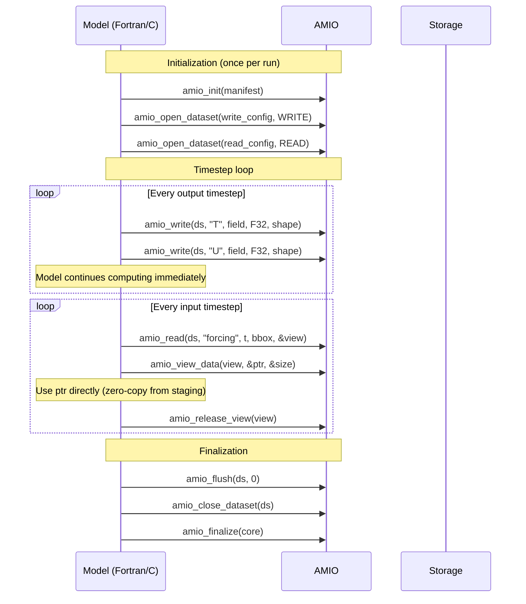

# Model Integration Guide

This guide describes how to integrate AMIO into an Earth system model
(ESM) or coupler component for high-performance parallel I/O.

## Integration Pattern

AMIO is designed as a drop-in I/O backend for model output and input.
The typical integration pattern:



## MPI Considerations

AMIO's NetCDF-4 backend uses parallel HDF5 with MPI-IO. The host
application must initialize MPI before calling `amio_init`:

```c
MPI_Init_thread(&argc, &argv, MPI_THREAD_MULTIPLE, &provided);
// ... later ...
amio_init("manifest.yaml", &core);
```

AMIO does not call `MPI_Init` or `MPI_Finalize` — that is the host's
responsibility. The `MPI_COMM_WORLD` communicator is used for parallel
I/O by default.

## Write Integration

### Snapshot Semantics

The key property of `amio_write` is **synchronous snapshot**: the host
data is deep-copied into a staging buffer before the call returns. This
means:

- The host can immediately reuse or deallocate its buffer
- No coordination is needed between the model's compute loop and I/O
- The actual disk write happens asynchronously on worker threads

### Minimal C Example

```c
#include <amio/amio.h>

void write_model_output(amio_dataset_handle ds,
                        const float *temperature,
                        int nx, int ny, int nz) {
    amio_shape_t shape = {0};
    shape.rank = 3;
    shape.extents[0] = nz;
    shape.extents[1] = ny;
    shape.extents[2] = nx;

    amio_io_handle io = NULL;
    amio_status_t rc = amio_write(ds, "temperature",
                                  temperature, AMIO_DTYPE_F32,
                                  &shape, &io);
    if (rc != AMIO_OK) {
        fprintf(stderr, "Write failed: %s\n", amio_strerror(rc));
    }
    // temperature buffer is safe to overwrite NOW
}
```

### Minimal Fortran Example

```fortran
subroutine write_model_output(ds, temperature, nx, ny, nz)
    use amio_mod
    use iso_c_binding
    type(c_ptr), intent(in) :: ds
    real(c_float), intent(in) :: temperature(nx, ny, nz)
    integer, intent(in) :: nx, ny, nz

    type(c_ptr) :: io_handle
    integer(c_int32_t) :: rc

    ! amio_write_array is a Fortran convenience wrapper
    call amio_write_array(ds, "temperature" // c_null_char, &
                          temperature, io_handle, rc)
    if (rc /= AMIO_OK) then
        print *, "Write failed: ", amio_strerror_f(rc)
    end if
end subroutine
```

## Read Integration

### Prefetch Look-Ahead

AMIO prefetches upcoming timesteps in the background. When your model
reads sequentially (t=0, 1, 2, ...), the data for t+N is already being
fetched while you process t. This hides I/O latency:

```
Time →
Model:   [compute t=0] [compute t=1] [compute t=2] ...
I/O:     [fetch t=0,1,2,3] [fetch t=4] [fetch t=5] ...
                           ↑ returned instantly (cached)
```

### Selective Reads (Bounding Box)

For regional models or domain decomposition, use a bounding box to read
only the sub-region you need:

```c
amio_bbox_t bbox = {0};
bbox.rank = 2;
bbox.offsets[0] = my_y_start;
bbox.offsets[1] = my_x_start;
bbox.extents[0] = my_ny;
bbox.extents[1] = my_nx;
bbox.strides[0] = 1;
bbox.strides[1] = 1;

amio_view_handle view = NULL;
rc = amio_read(ds, "sst", timestep, &bbox, &view);

const void *data = NULL;
size_t nbytes = 0;
rc = amio_view_data(view, &data, &nbytes);
// data contains only the requested sub-region (my_ny × my_nx)
// nbytes == my_ny * my_nx * sizeof(float)

amio_release_view(view);
```

Strided reads are also supported (`bbox.strides[d] > 1`) for
coarsening/subsampling without transferring the full resolution.

## Mixed-Format Translation

AMIO supports reading from one format and writing to another in the
same run without external ETL:

```c
// Read from NetCDF-4
amio_dataset_handle src = NULL;
amio_open_dataset(core, "netcdf_source.yaml", AMIO_MODE_READ, &src);

// Write to Zarr v3
amio_dataset_handle dst = NULL;
amio_open_dataset(core, "zarr_target.yaml", AMIO_MODE_WRITE, &dst);

// Read a variable
amio_view_handle view = NULL;
amio_read(src, "temperature", 0, NULL, &view);

const void *data = NULL;
size_t nbytes = 0;
amio_view_data(view, &data, &nbytes);

// Write the same bytes to the target format
amio_shape_t shape = {.rank = 2, .extents = {ny, nx}};
amio_io_handle io = NULL;
amio_write(dst, "temperature", data, AMIO_DTYPE_F32, &shape, &io);

amio_release_view(view);
amio_flush(dst, 0);
```

Both datasets share the same staging pool and worker threads. No
intermediate copies or format conversions are needed.

## Error Handling Best Practices

```c
amio_status_t rc = amio_write(ds, var, data, dtype, &shape, &io);
switch (rc) {
    case AMIO_OK:
        break;  // success
    case AMIO_ERR_STAGING_BACKPRESSURE:
        // Staging pool full — model is producing faster than I/O
        // can drain. Options: increase buffer_count, or retry.
        break;
    case AMIO_ERR_BACKEND_FAILURE:
        // Storage error — disk full, network down, etc.
        break;
    default:
        fprintf(stderr, "Unexpected: %s\n", amio_strerror(rc));
}
```

## Configuration for Model Runs

A typical HPC model run uses:

```yaml
# manifest.yaml
staging_pool:
  buffer_count: 16           # 2× concurrent variables
  buffer_capacity_bytes: 52428800  # 50 MiB (fits one 3D field)
worker_pool:
  threads: 4                 # Dedicated I/O threads
prefetch:
  depth: 8                   # Look-ahead 8 timesteps
  read_timeout_s: 120        # 2 min timeout for slow storage
staging_timeout_ms: 30000    # 30s backpressure timeout
backend: netcdf4
path: /scratch/model_output.nc
data_model: classic
codec:
  active_codec: blosc
  lossless_allow_list:
    - blosc
```

## Thread Safety

- `amio_init` / `amio_finalize`: Call from a single thread (typically
  the main rank).
- `amio_write`: Thread-safe across different variables. Same variable
  writes are serialized by the worker pool's per-(dataset, variable)
  ordering.
- `amio_read`: Thread-safe for different variables. Same variable reads
  from multiple threads are serialized by the per-variable mutex.
- `amio_flush` / `amio_close`: Call from the same thread that opened
  the dataset.

## Performance Tuning

| Parameter | Effect | Guidance |
|-----------|--------|----------|
| `buffer_count` | Concurrency headroom | 2× max overlapping writes |
| `buffer_capacity_bytes` | Max single-field size | ≥ largest variable payload |
| `worker_pool.threads` | I/O parallelism | 2–4 for local disk, 4–8 for cloud |
| `prefetch.depth` | Read look-ahead | 4–16 depending on access pattern |
| `staging_timeout_ms` | Backpressure patience | 5000–30000 ms |
